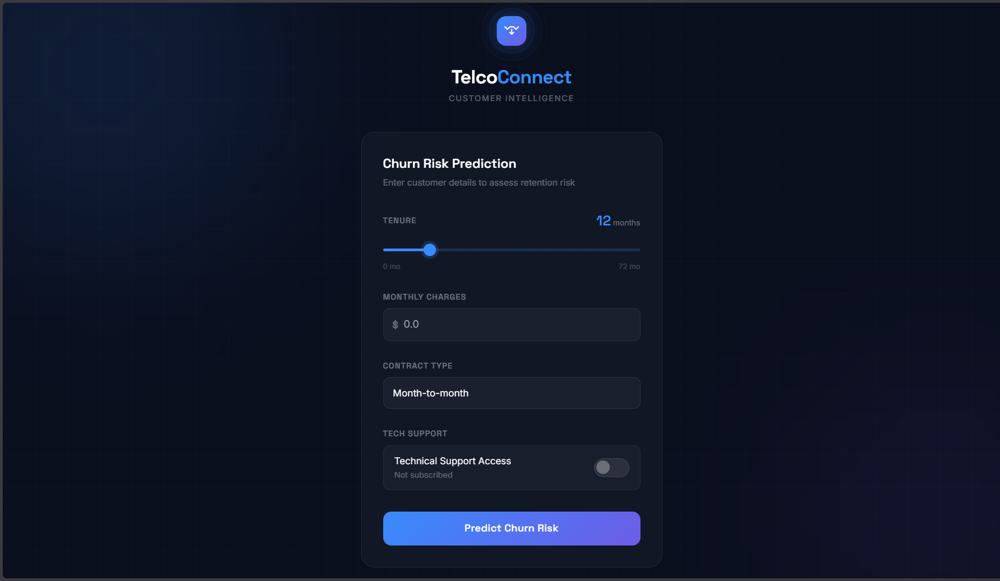

# TelcoConnect — Customer Churn Predictor

> Predicts which telecom customers are likely to churn using a
> Logistic Regression pipeline trained on 6 customer features.
> Served via a Flask web application.

---

## Demo

<!-- Add a screenshot or GIF of your web app here -->



---

## Problem Statement

Customer churn is one of the most costly problems in the telecom
industry. This project builds an end-to-end ML pipeline that flags
at-risk customers before they leave, giving retention teams enough time to intervene.

---

## Results

| Model               | Precision (Churn) | Recall (Churn) | F1   |
| ------------------- | ----------------- | -------------- | ---- |
| Logistic Regression | 0.80              | 0.81           | 0.80 |
| Random Forest       | 0.79              | 0.78           | 0.79 |
| Neural Network      | 0.71              | 0.96           | 0.82 |

**Why Logistic Regression over Neural Network?**
The Neural Network achieved 0.96 recall but only 0.71 precision —
too many false positives for a retention team to act efficiently.
Logistic Regression's balanced 0.81/0.80 is more operationally useful
and significantly simpler to deploy.

---

## Features Used

| Feature         | Notes                              |
| --------------- | ---------------------------------- |
| Tenure          | Months with the company            |
| Monthly Charges | Current monthly bill               |
| Contract        | Month-to-month, One year, Two year |
| Tech Support    | Whether customer has tech support  |

---

## Project Structure

```
root/
├── app/
│   ├── app.py              # Flask application
│   ├── templates/
│   │   └── index.html      # Frontend UI
│   └── static/             
├── database/
│   ├── create_db.sql        # DB create
│   ├── init_db.sql        # Schema
│   └── db_config.py       # DB connection
├── models/
│   └── champ_model.pkl     # Saved pipeline
├── notebooks/
│   ├── 01_sandbox_eda.ipynb    # EDA on sandbox data
│   ├── 02_data_generator.ipynb  # Data Generator Scrpit analysis
│   └── 03_big_data_eda.ipynb   # Big DATA EDA
├── src/
│   ├── data_generator.py   # Correlational Data Generator
│   └── train.py            # Training script
├── requirements.txt
├── .env
├── .gitignore
└── README.md
```

**`.gitignore` should include:**
```
.env
__pycache__/
*.pyc
.ipynb_checkpoints/
models/*
*.keras
Thumbs.db
.DS_Store
.vscode/

# Not ignoring because we deployed on Render
!models/champ_model.pkl
```

---

## Pipeline

```
Raw Data (SQL)
    → ColumnTransformer
        → Numerical (tenure, monthly_charges): SimpleImputer → MinMaxScaler
        → Categorical (contract): OneHotEncoder
        → Binary (tech_support): pre-mapped with .map()
    → LogisticRegression (GridSearchCV, scoring='accuracy')
    → Serialized as champ_model.pkl via joblib
```

---

## Setup

**1. Clone the repo**

```bash
git clone https://github.com/Ash2oP/first-end-to-end-ml-project.git
cd first-end-to-end-ml-project
```

**2. Create and activate environment**

```bash
conda create -n first-end-to-end-ml-project python=3.12
conda activate first-end-to-end-ml-project
```

**3. Install dependencies**

```bash
pip install -r requirements.txt
```

**4. Set up the database**

```bash
python database/create_db.py # Create Database
python database/create_db.py # Schema
python database/init_db.py   # Correlated Data Generator
```
**`.env` should include your credentials in this format:**
```
DB_HOST=
DB_PORT=
DB_NAME=
DB_USER=
DB_PASSWORD=
```

**5. Train the model**

```bash
python src/train.py
```

**6. Run the app**

```bash
python app/app.py
```

Visit `http://localhost:5000`

---

## Key Decisions

**Why Logistic Regression over Neural Network?**
The Neural Network achieved 0.96 recall but only 0.71 precision —
meaning too many false positives for a retention team to action.
LR's balanced 0.81/0.80 is more operationally useful.

**Why bundle preprocessing into the pipeline?**
Prevents train/test leakage and ensures the Flask app can accept
raw input without manual scaling.

**Why `scoring='accuracy'` over `scoring='f1'` in GridSearchCV?**
Both were evaluated. Tuning with `scoring='f1'` pushed the model toward 
the Neural Network's profile — high recall, lower precision — which 
defeated the purpose of choosing Logistic Regression in the first place.
`scoring='accuracy'` produced the balanced precision-recall tradeoff 
that made LR the right business decision.

---

## Tech Stack

- **Data**: PostgreSQL
- **ML**: scikit-learn, TensorFlow
- **Serving**: Flask
- **Frontend**: Tailwind CSS
- **Serialization**: joblib

---

## Author

Ashish — 
[GitHub](https://github.com/Ash2oP)
